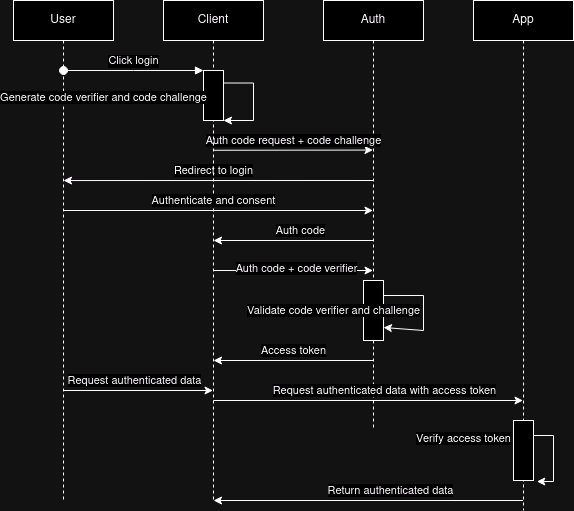

# OAuth Authentication

- Authenticate with Google, Facebook, Github, Microsoft, ...
- Multiple different flows to this
- Distributed trust

## Instructions

1. `npm i`
1. `npm run start`
1. In browser head to the [app](http://localhost:3000)
1. Click login
1. Will be redirected to [authentication server](http://localhost:8080)
1. After successful login will be redirected to [app](http://localhost:3000)
1. On redirect a token will be requested and you can click Fetch authenticated data

## Sequence

## Notes

- In order to truly have distributed trust JWK should be used (public key authentication)
- To prevent token expiry join the refresh token flow with this flow
- Create sequence diagram
- Build rest.http flow
- Go through different flows and which to use

## References

- [RFC 6749](https://datatracker.ietf.org/doc/rfc6749/)
- [Auth0 PKCE](https://auth0.com/docs/get-started/authentication-and-authorization-flow/authorization-code-flow-with-pkce)
